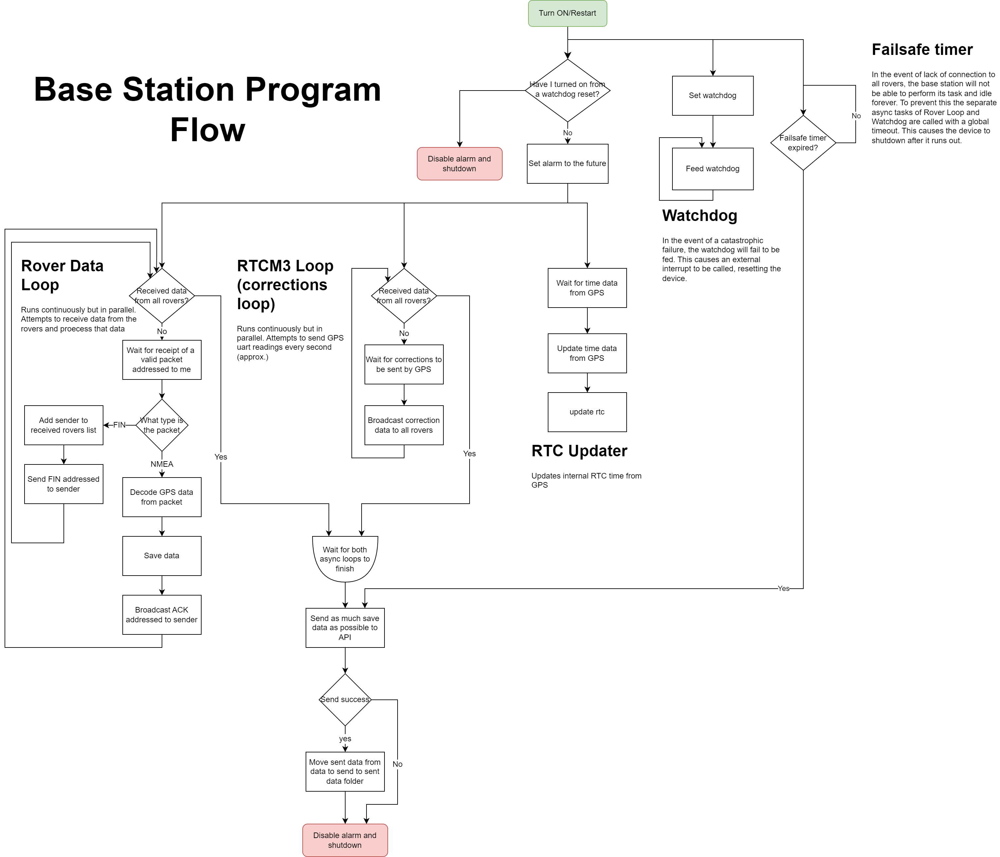
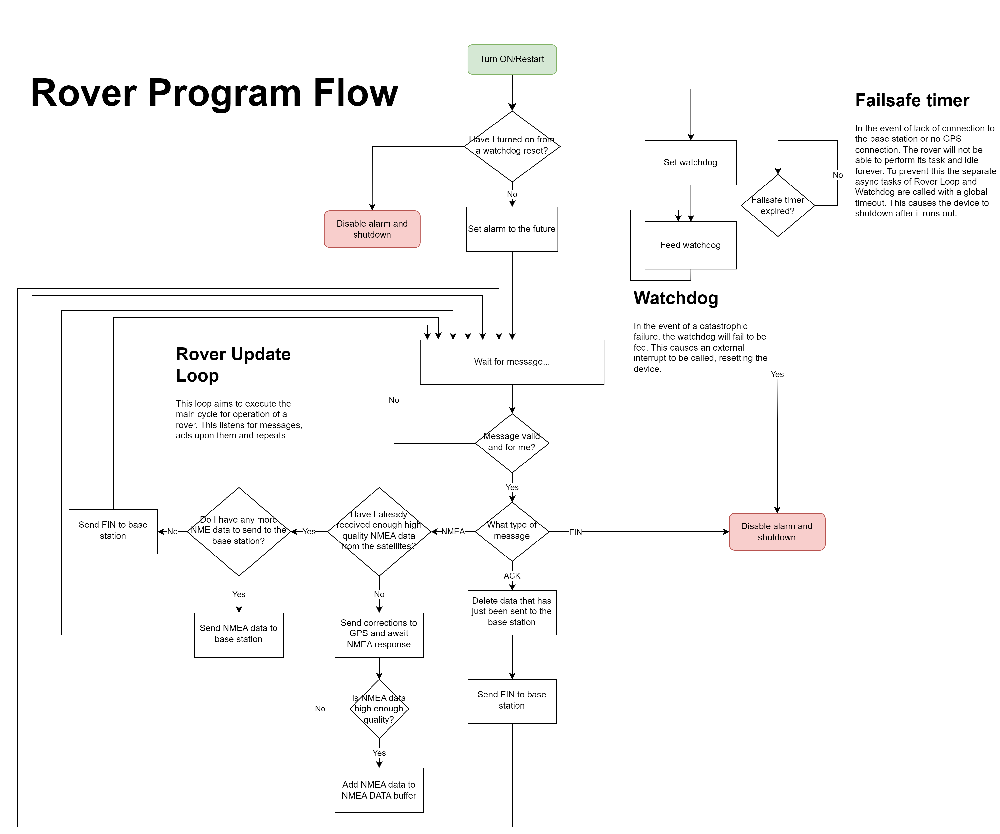
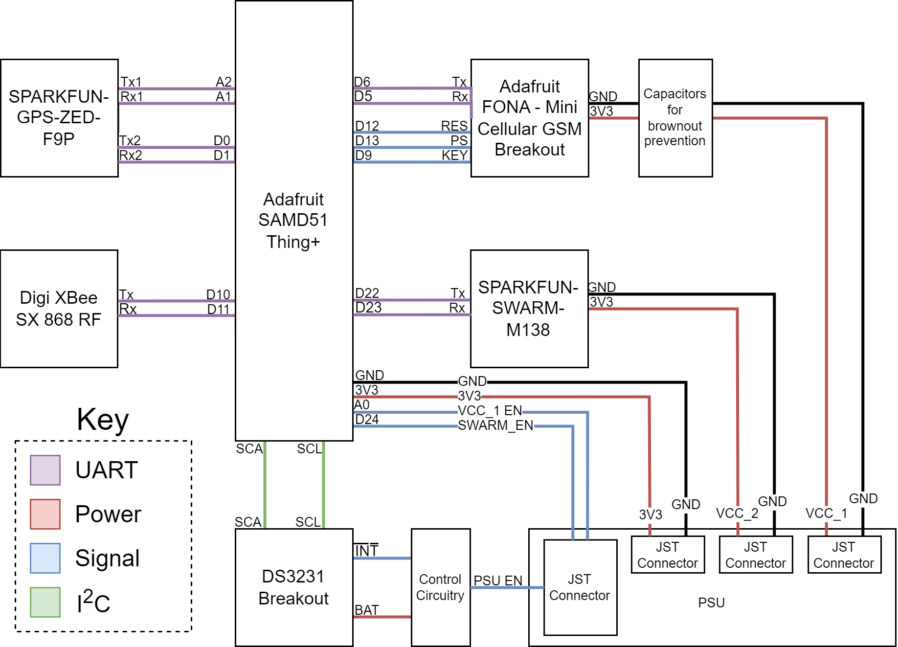

.. glactracker_firmware documentation master file, created by
   sphinx-quickstart on Wed Jan 11 16:09:19 2023.
   You can adapt this file completely to your liking, but it should at least
   contain the root `toctree` directive.

Welcome to glactracker_firmware's documentation!
================================================

In these docs you will find an index of all our code files, as well as a brief explanation
of our code structure that we will get into now.

In short, the firmware code is mostly made up of 5 folders and 3 main files, including the files in the root folder.

* ``Drivers`` contains code that interracts with hardware devices
* ``RadioMessages`` contains serialization for common radio packet payloads
* ``Statistics`` contains helper code for doing mathematical operations on data samples (i.e. GPS coordinates)
* ``UBX-CFG`` contains the configuration files to be uploaded to the GPS modules of their respective device types
* ``Utility`` contains some helper files that can be run as one-offs to configure some hardware via the MCU

Main files include:

* ``main.py`` which is the file that is started by CircuitPython. It determines the device's type and then executes one of the other main files (and handles watchdog resets)
* ``Base.py`` is all the base-specific main code, including its scheduled tasks and GSM upload sequence
* ``Rover.py`` is all the rover-specific main code, which is made up almost entirely of its scheduled tasks and a shutdown sequence.

A visualization for the rover and base code can be seen here:

   Flow diagram of ``Base.py``

   Flow diagram of ``Rover.py``

Other misc files include:

* ``boot.py`` which configures the onboard storage so that it is read/writable from the Thing+
* ``config.py`` which is the device-specific configuration parameters (including some debug configuration)
* ``lib`` folder which is all 3rd party libraries (some of which are modified)

Finally, a wiring diagram for the device can be seen here, which is a useful reference when looking at some of the driver code:

   Main circuit wiring diagram

.. toctree::
   :maxdepth: 2
   :caption: Contents:

Indices and tables
==================

* :ref:`genindex`
* :ref:`modindex`
* :ref:`search`
